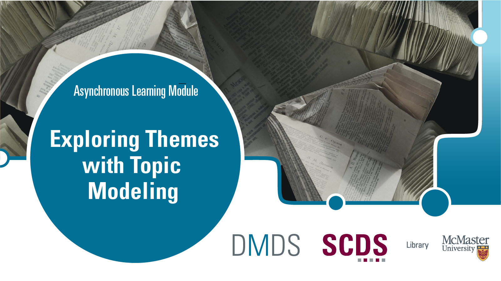

# Exploring Themes with Topic Modeling

***Exploring Themes with Topic Modeling* belongs to a series of workshops on computational text analysis.**

When working with texts at scale, we may wish to generalize the "about-ness" of the entire corpus without having to read through each document. Computational methods can allow us to quickly explore relationships between frequently used words and make inferences about themes from the results returned.

Topic modeling is a natural language processing technique that groups words in “topics” based on the frequency of their appearance near each other in a text. It can be used to interpret thematic trends within a large body of text. 

In this workshop, we will introduce topic modeling using three different computational tools.

## Prerequisites
* Basic computer literacy (creating and working with different file types, navigating interfaces, using shortcut keys and so on)

## Learning Objectives
By the end of the workshop, you will be able to:
* Define topic modeling
* Use at least one tool to perform topic modeling on a text corpus 
* Explain the limitations of topic modeling

## Duration
Going through the workshop from start to finish (and you need not necessarily!) will take you approximately 1 hour to complete, depending on your familiarity with Python and whether you are working with your own dataset alongside the sample corpus.

## Land Acknowledgement

We’d like to acknowledge that McMaster University sits on the Territories of the Mississauga and Haudenosaunee Nations, and within the lands protected by the Dish With One Spoon wampum agreement.
