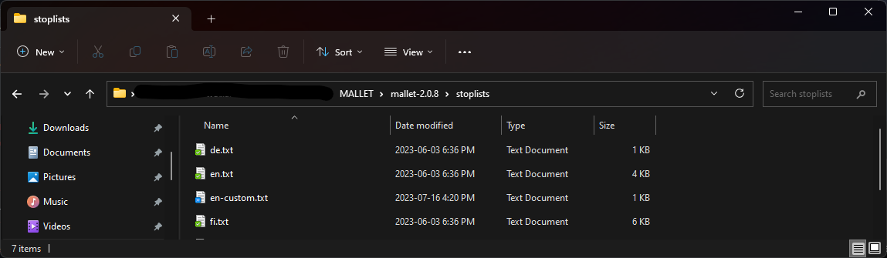
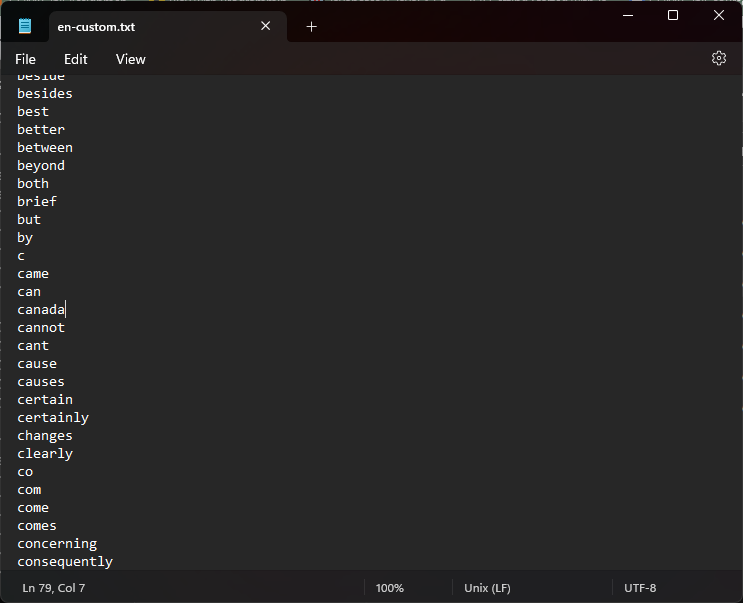
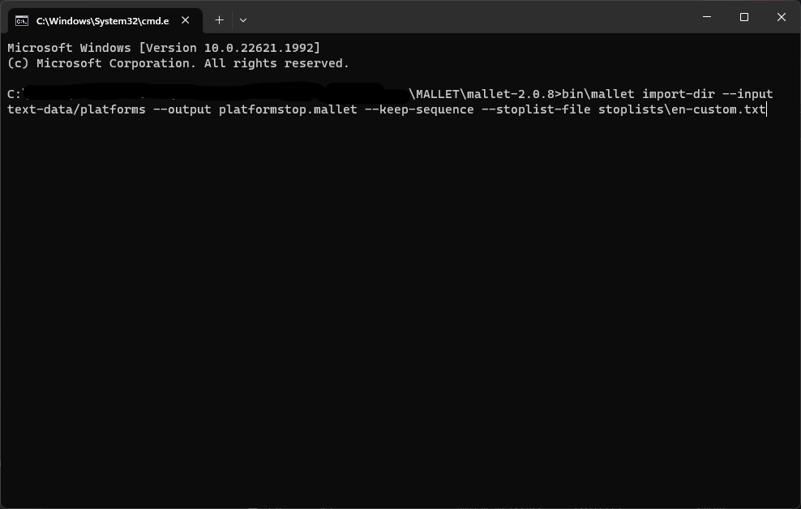

# Topic Modeling with MALLET

## About MALLET

MALLET, or **MA**chine **L**earning for **L**anguag**E** **T**oolkit, is an open-source, Java-based package for performing machine learning tasks on texts such as information extraction or topic modeling. It is widely used in the academic Digital Scholarship community, and there is a [spectacular lesson on topic modeling with MALLET](https://programminghistorian.org/en/lessons/topic-modeling-and-mallet) created by Graham, Weinhart and Milligan on the [Programming Historian website](https://programminghistorian.org/).

If you would prefer to not use a programmming language like Python to perform topic modelling, MALLET is a robust and easy-to-use command line tool that comes with a pre-trained model. As with Voyant, you may find MALLET adequate for your purposes and decide not to go any further in the lesson.

Below, we have created a video that takes you through the steps of the lesson created by Graham et al. on a Mac OS. On Windows, the commands vary slightly; we will note in the video where there are differences. You can also simply go directly to the lesson on the Programming Historian if you prefer a static set of instructions with screenshots to video; the screenshots are from a Windows OS.

**Important note:** please use [the version of MALLET specified in the Programming Historian lesson](https://mallet.cs.umass.edu/download.php), 2.0.8. It is not the most recent version of the software, which currently (as of June 2023) throws a "Could not find or load main class cc.mallet.classify.tui.Text2Vectors" Java exception that I was unwilling to troubleshoot :-)

## Using MALLET on a Mac

video

## Try it with your data: Creating a custom stopword list

If you think MALLET might be your topic modeling tool of choice, you likely will also find it helpful to add your own stopwords to the default list. In the video, for example, "it's" appeared in one of the topics. As with any stopword list, there are bound to be some missed terms that you will discover when you start modeling topics; you might also have corpus-specific terms that you would like to ignore without making permanent changes to the list that MALLET uses.

In MALLET, you remove stopwords during the import process - before you create the .mallet file. There is also a `prune` command that allows you to omit words based on statistics about the entire dataset *after* you have created the .mallet file (e.g. removing low frequency terms, which rarely appear in the corpus); you can read more about the `prune` command in the [MALLET documentation](https://mimno.github.io/Mallet/transforms).

The stopword list that MALLET uses when importing files or directories can be found in the MALLET directory, the folder that you downloaded and unzipped from the MALLET website. In the MALLET directory, locate the folder called "stoplists" which contains plain text files (.txt file extension) with lists of stopwords for various languages. If your corpus contains English-language documents, you can open the en.txt file with a text editor if you would like to get a sense of what the default list contains - you should **not** make any changes to the file, however.

In the same folder, **make a copy** of the en.txt file and call it `en-custom.txt`. On a new line in the document, put the stopword(s) you would like to omit from the topic model. For demonstration purposes, I used 'canada' because it occurs commonly across all of the texts. Of course, we would probably not want to remove 'canada' when topic modeling the political party platforms corpus, as it might appear more frequently in platforms that wish to project a sense of patriotism - which would be of interest in our analysis.

With our stoplist file created, we can now import our directory of files as described in the video above and in Graham, Weinhart and Milligan's lesson on the Programming Historian. At the end of the command, add `--stoplist-file stoplist\en-custom.txt` (recalling that you will use forward slashes on a Mac). We are specifying the file with the list of stopwords that we created, and including the name of the containing folder - "stoplist" - points MALLET to where to find it.

**Important note:** MALLET's primary maintainer David Mimno recommends *against* using the `--stoplist-file` option with `--remove-stopwords` because "[using both options will remove the union of the two lists](https://stackoverflow.com/questions/48121694/mallet-topic-modeling-remove-most-common-words)" or the terms that appear in both lists. Run the `train-topics` command with the .mallet file you created and verify your results - the stopwords you added should no longer appear in your topics! 

Next --> [Topic Modeling with Python](tmpython.html)
