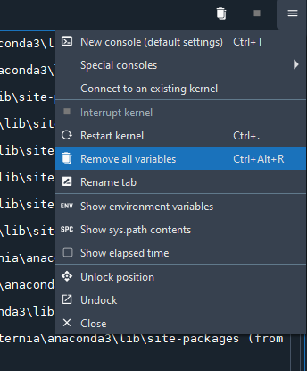
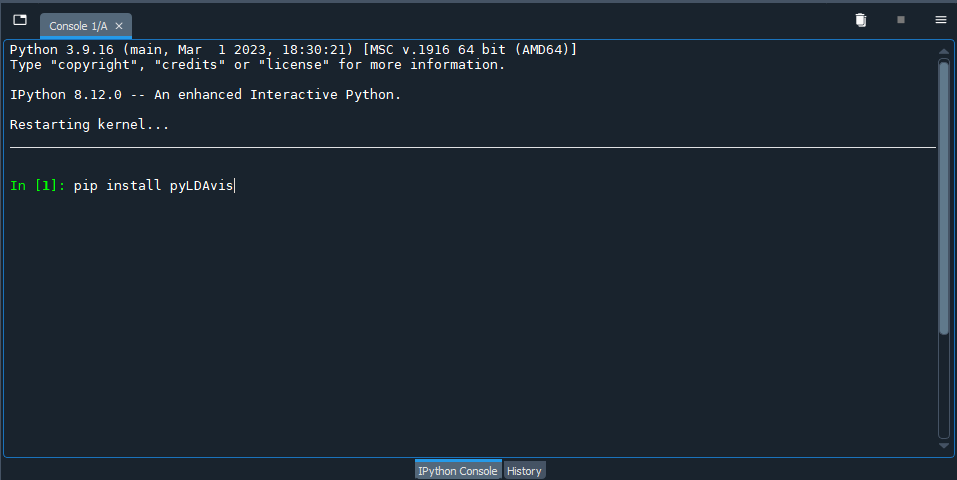
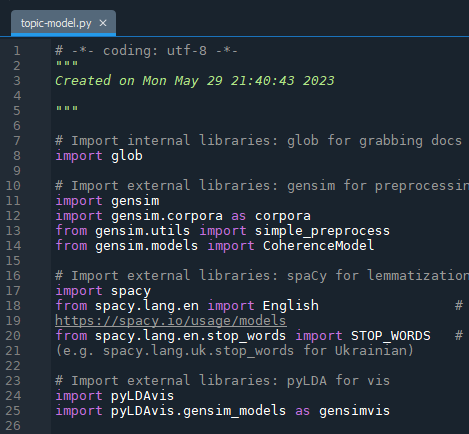

# Topic Modeling with Python (Gensim & SpaCy)

Our third tool for topic modeling is the Python programming language. The lesson that follows uses Spyder, an open source integrated development environment (IDE) bundled in with the Anaconda data science platform that you were encouraged to download at the beginning of the lesson. If you are new to programming (and perhaps not too keen to learn), you may alternatvely wish to use the [Jupyter notebook instance of the script](https://colab.research.google.com/drive/1biLTOz5Va-824g7o94Le9QIRM0jxx2ty?usp=sharing). Instructions on how to run the script are included in the notebook, and there is a [video recording of how to use the script](https://echo360.ca/media/12af901f-4582-4b13-92c5-6e7915e99dcd/public?startTimeMillis=7706430) from a previous workshop (topic modeling starts around 2:08:15); the videos and screenshots below demonstrate the Spyder IDE workflow.   

You can compare the results that you get from running the script in Jupyter Notebooks on your corpus subset with your results from MALLET and Voyant. If you get the richest and most coherent topics in Python, that is the tool you will want to work with for you full corpus. You may even wish to compare results between Jupyter Notebooks and the Spyder IDE, as outlined below.

Jump to step >

1. [Install the required packages](#1-install-the-required-packages)
2. [Import internal and external libraries (i.e. dependencies)](#2-import-internal-and-external-libraries-ie-dependencies)
3. [Read the files containing the text data](#3-read-the-files-containing-the-text-data)
4. [Identify stopwords for the corpus](#4-identify-stopwords-for-the-corpus)
5. [Tokenize and lemmatize text data, and remove stopwords](#5-tokenize-and-lemmatize-text-data-and-remove-stopwords)
6. [Preprocess texts using the Gensim library](#6-preprocess-texts-using-the-gensim-library)
7. [Combine bigrams and trigrams](#7-combine-bigrams-and-trigrams)
8. [Create a dictionary of words used in the corpus](#8-create-a-dictionary-of-words-used-in-the-corpus)
9. [Retrieve words from corpus dictionary](#9-retrieve-words-from-corpus-dictionary)
10. [Create topics in Gensim](#10-create-topics-in-gensim)
11. [Create topic modeling visualization with LDAvis](#11-create-topic-modeling-visualization-with-ldavis)

## **1.** Install the required packages
Our Python script is dependent on a few external packages that are not installed on Anaconda by default. We must install them before we can start writing our script, as our next step is to import them!

Type (or copy-paste) each of the commands below in the iPython console, which - in the default view of the Spyder IDE - is in the bottom right corner. After each command, hit enter to run. You should see a message that tells you the status of the installation, and you may be instructed to restart the kernel. You can restart the kernel using the shortcut key `Ctrl` + `.` on Windows, `Cmd` + `.` on a Mac, or by selecting it from the hamburger menu at the top right of the iPython console window.

* Install SpaCy to preprocess the text data 
`pip install spacy`

* Install the trained language model from SpaCy required to use the SpaCy library 
`pip install https://github.com/explosion/spacy-models/releases/download/en_core_web_sm-3.5.0/en_core_web_sm-3.5.0-py3-none-any.whl`

* Install Gensim to create the topics 
`pip install gensim`

* Install pyLDAvis to create a visualization of the topics 
`pip install pyLDAvis`

## **2.** Import internal and external libraries (i.e. dependencies)
Now, we will start writing our script in the Spyder editor (left pane in the default interface). Our first step is to import the libraries we just installed to let the console know that we require them. We will highlight when we use the various libraries in our code to give you a sense of where they fit in to the picture!

Begin by creating a new file in Spyder. After the initial code comments that Spyder provides for you, and which you can elaborate upon if you like, type or copy / paste the following commands and comments:

    # Import internal libraries: glob for grabbing docs from directory
    import glob

    # Import external libraries: spaCy for tokenization, lemmatization and stopwords
    import spacy
    from spacy.lang.en import English                 # For other languages, refer to the SpaCy website: https://spacy.io/usage/models
    from spacy.lang.en.stop_words import STOP_WORDS   # Also need to update stopwords for other languages (e.g. spacy.lang.uk.stop_words for Ukrainian)

    # Import external libraries: gensim to create models and do some additional preprocessing
    import gensim
    import gensim.corpora as corpora
    from gensim.utils import simple_preprocess
    from gensim.models import CoherenceModel
    
    # Import external libraries: pyLDA for vis
    import pyLDAvis
    import pyLDAvis.gensim_models as gensimvis
    
You will note in the code above there is the option of working with texts in languages other than English.

If you have not saved the script yet, go ahead and do so. Make a note of where you are saving the script, because you will need to save your text data relative to where the script is located as described below.

## **3.** Read the files containing the text data
Our next step is to load our text files in a manner that they can be used; i.e. storing them in a list data structure in Python. We will employ [the `glob` library](https://docs.python.org/3/library/glob.html) we imported in the previous step. The `glob` library allows us to grab the contents of a directory using pattern matching.

In order to use the lines of code below, you will need to create a new directory (folder) in the same folder that contains the python script you are creating. Call the folder "corpus" (note the reference to `'./corpus'` below) and copy your text files to it. 

For the lines of code below to run, the files must end with the `.txt` file extension - a commonly used file format in text analysis. Alternatively, you can replace `'/*.txt'` below with `'/*.doc'` or `'/*.docx'` but all your text files must have the same file extension. The number of characters you can work with - rather than the number of documents - is limited by SpaCy's default threshold, as will be discussed later in the lesson. 

The script will also work with a single text file in the "corpus" folder. 

**Important:** step 3 is slightly different depending on your operating system. If you are running the script on a Mac (or Bash shell), uncomment the first "file_list" variable assignment statement below. If you are running the script on a Windows OS, uncomment the second of the statements and update "\[path to folder]" to the pathname of the "corpus" folder. To find the pathname: open a File Explorer window, navigate to the corpus folder and copy the path in the address bar.

    # Read files from directory and create list from contents
    # file_list = glob.glob('./corpus' + '/*.txt') # directory containing text (.txt) files # uncomment for Mac OS or Linux
    # file_list = glob.glob(r'[path to folder]\*.txt') # uncomment for Windows OS and replace "[path to folder]" with the path to the "corpus" folder
                                                       # e.g. C:\Users\username\corpus

    texts = []

    for filename in file_list:
        with open(filename, mode = 'r', encoding = 'utf-8') as f: # specify encoding as appropriate
            texts.append(f.read())

    print(texts[0]) # print the first .txt file in the list to confirm

You will likely need to adjust the encoding value, based on the encoding of your text files. You can look up how to specify other encodings in Python using the [Standard Encodings table](https://docs.python.org/3/library/codecs.html#standard-encodings); the value to replace in your script can be found in the "Codec" column of the table (e.g. `'mac-roman'`, `'latin-1'`). 

If you do not know the encoding of your text files, you can check it in:

1. Windows OS: open the file in Notepad (default text editor in Windows) and then use the "Save as..." command - the current encoding will be visible in the area where you can specify the encoding of the new file (you do not need to actually save the file, we are just checking the encoding) 
2. Mac OS: in the TextEdit application (default text editor in Mac), \[reference: https://support.apple.com/en-ca/guide/textedit/txted1028/mac]

Use the F5 key to run the script thus far in the console. In the console area, the text from the first document should print. In the variable explorer pane (top right, second tab in the Spyder IDE), new variables named `file_list` and `texts` should appear with expected text data values.

## **4.** Identify stopwords for the corpus

Stopwords are commonly used words - such as "and," "the," "we" and... well, "as" - that can be expected to be found in any text and so, can be omitted from our analysis because they are unlikely to be of any interest. Stopwords will be removed in the next step - after tokenizing and before lemmatizing - but let us first review what words are in the list and evaluate whether we need to add or remove words.

What constitutes a stopword will vary depending on your corpus and what you are seeking in your analysis. You may find it easiest to run through most of the script, up to creating the topics in [Step 9](#9-create-topics-in-gensim), and then coming back to this step to refine your stopwords. If you already know some of the stopwords you would like to remove from an initial data analysis step (i.e. if you [created topics in Voyant](tmv.html), however, you can add them now.

Most of the code below is commented out, i.e. preceded by `#`. To add stopwords to the list, remove the `#` and substitute `[word]` with your word (ensure that you leave in the single quotes to denote that you are entering string data). Uncomment - remove the `#` - before the second `print(STOP_WORDS)` in the code to verify your work.

    # Print the initial set of stopwords from SpaCy
    # Also available at: https://github.com/explosion/spaCy/blob/master/spacy/lang/en/stop_words.py
    print(STOP_WORDS)

    # Add a word to remove or add from the list
    # STOP_WORDS.add('[word]') 
    # STOP_WORDS.remove('[word]')

    # Print to confirm that your word has been added or removed
    # print(STOP_WORDS)

Again, use the F5 key to run the script in the console.

## **5.** Tokenize and lemmatize text data, and remove stopwords

You may have noticed from the contents of the `text` variable in the Variable Explorer pane, we are currently working with unstructured data - paragraphs and sentences. We can make sense of unstructured data but a computer has a harder time working with it. Even in machine learning applications, where you might enter paragraphs or sentences, the system is typically performing similar steps in the background. 

Our next step, therefore, is to turn our text data into tokens, or a list of individual words. Since topic modeling is dependent on term frequencies - how often a given word appears in a segment of text and with other words - tokenizing allows for the computer to count and classify comparable terms.

Similarly, in the lemmatization process, SpaCy's lemmatizer tool analyzes tokens to determine their "root" form and reduces them to it. Otherwise, a computer would treat "banana" and "bananas" as two distinct terms when - for the purposes of our analysis - they are not.

The SpaCy nlp pipeline - or workflow - also removes the stopwords we added in step 4.

    # Lemmatize tokens
    def lemmatization(texts, allowed_postags=["NOUN", "ADJ", "VERB", "ADV"]):   # Doing part of speech (PoS) tagging helps with lemmatization
        # Load the nlp pipeline, omitting the parser and ner steps of the workflow to conserve computer memory
        nlp = spacy.load("en_core_web_sm", disable=["parser", "ner"]) # For other languages, use models from step 2
        texts_out = []
        for text in texts: # Run each of the documents through the nlp pipeline
            doc = nlp(text)
            new_text = []
            for token in doc:
                if token.pos_ in allowed_postags:
                    new_text.append(token.lemma_)
            final = " ".join(new_text)
            texts_out.append(final)
        return (texts_out)

    lemmatized_texts = lemmatization(texts)
    print(lemmatized_texts[0][0:90]) # Print results to verify; you can also check the Variable Explorer in Spyder

> ***Note:** there is a maxium of one million characters in the default nlp pipeline; if you try to run with script on text data with more than one million characters, you will get an error to that effect. The one million character threshold is based on (anticipated) available RAM.*

**If you get a max character error** (and only if), you can change the maximum number of characters using nlp.max_length as below:

    nlp = spacy.load('en_core_web_sm')
    nlp.max_length = 1500000 # Or other value, given sufficient RAM

If your machine balks (i.e. stops responding, serves you up a spinning beach ball of death or otherwise appears unhappy) at the higher number of characters after modifying the pipeline steps, you may have to break your document(s) into smaller chunks. With some text analysis techniques (e.g. NER), splitting a corpus has no effect on the end result - but, needless to say, it will make a big difference to the topics created. If you find yourself having to work with smaller subsets of your text data, select or arrange them thoughtfully! 

## **6.** Preprocess texts using the Gensim library

For our next step, we will convert our text data into a form that the Gensim library expects to work with: a list data type in Python. The `gensim.utils.simple_preprocess` tool repeats some of the previous preprocessing steps we performed with SpaCy, namely tokenization, which occurs while creating the `Doc` object, and converting tokens to lowercase, which occurs during the lemmatization process. Multiple libraries exist to preprocess text data and there is bound to be some overlap!

What Gensim adds to our preprocessing workflow is the ability to remove accents and the outputting of a list of unicode string tokens that we can then use for topic modeling in Gensim. If you are working with languages others than English, you may not wish to remove accents; Elvia Arroyo-Ramirez [has written about the linguistic imperialism](https://medium.com/on-archivy/invisible-defaults-and-perceived-limitations-processing-the-juan-gelman-files-4187fdd36759) common to working computationally with text.

If you wish, you can also supply `gensim.utils.simple_preprocess` with an optional parameter to omit words of a particular length, e.g. min_len=3 will exclude words less than 3 characters. In the code block below, you would write `new = gensim.utils.simple_preprocess(text, deacc = True, min_len=3)`. As with removing stopwords, setting a higher minimum word length can help to discard common words that are not relevant to your analysis but it will depend on your corpus.

You can rewrite (for additional practice and experience) or copy and paste the text below to the end of your script. Because creating the SpaCy `Doc` object in the previous step takes time and does not need to be repeated by running the entire script again, you may wish to simply select the new lines of code you added in the current step and use the `F9` key to run the selection.

    # Preprocess texts
    def gen_words(texts):
        final = [] # Create an empty list to hold tokens
        for text in texts:
            new = gensim.utils.simple_preprocess(text, deacc = True) 
            # If working with languages that employ accents, you can set deacc to False
            final.append(new)
        return (final)

    data_words = gen_words(lemmatized_texts) # Pass lemmatized_texts from previous step through the gen_words function

After running the lines of code, head over to the Variable Explorer pane in Spyder. You should now have a few new variables, one of which is named `data_words` that contains the tokens. Note the difference in formatting (i.e. syntax) from `lemmatized_texts` indicating that the contents of the variable are of a list data type.

## **7.** Combine bigrams and trigrams

The word "new" may appear frequently in our corpus - but then, one of our documents is the 2021 platform for the *New* Democratic Party. If we do not count instances of "New Democratic Party" in the text, is the term "new" still prevalent?

Bigrams and trigrams are sets of consecutive words - two and three in a row, respectively. If they reoccur multiple times within the text, Gensim will connect them with an underscore ('human_right' or 'streaming_service') when creating the token list to provide additional context around the sense in which the term is being used. The term "high_speed_internet" is more semantically rich than "high," "speed" or "internet" on their own. 

The code below is from [Selva Prabhakaran](https://www.machinelearningplus.com/nlp/topic-modeling-gensim-python/#9createbigramandtrigrammodels). After running the block of code below (`F9`), the variable "data_bigrams_trigrams" will appear in the Variable Explorer pane, where you can inspect the contents of the variable. Alternatively, you can uncomment the last line of the code below (i.e. remove the "#" symbol in front of the "print" statement) and print out the list of terms in the console window. 

    bigram_phrases = gensim.models.Phrases(data_words, min_count=3, threshold=50)
    trigram_phrases = gensim.models.Phrases(bigram_phrases[data_words], threshold=50)

    bigram = gensim.models.phrases.Phraser(bigram_phrases)
    trigram = gensim.models.phrases.Phraser(trigram_phrases)

    def make_bigrams(texts):
        return [bigram[doc] for doc in texts]

    def make_trigrams(texts):
        return [trigram[bigram[doc]] for doc in texts]

    data_bigrams = make_bigrams(data_words)
    data_bigrams_trigrams = make_trigrams(data_bigrams)

    # --Uncomment to print list of words showing bigrams and trigrams
    # print (data_bigrams_trigrams[0])

## **8.** Create a dictionary of words used in the corpus

In order to be able to count the number of times a given word is used, a value needed for topic modeling, we will next create a dictionary from our tokens using the `tuple` data structure in Python (not to be confused with the `dict` or dictionary data structure). A tuple is like a list except that it is immutable - because we do not want our dictionary to change! Our tuple data structure stores two items in a (key, value) pair; e.g. (1, 8). 

    # Create dictionary of all words in texts
    id2word = corpora.Dictionary(data_words)

    # Represent dictionary words as tuples (index, frequency)
    corpus = []
    for text in data_words:
        new = id2word.doc2bow(text)
        corpus.append(new)

Select the lines above within your script and use the `F9` shortcut key to run the code. Again, we can inspect our results in the Variable Explorer in Spyder: the contents of the newly-created `corpus` variable. The results will be a series of number pairs, e.g.\[(0, 12), (1, 5), (2, 1), (3, 7), (4, 1), ..., (*n*, 15)]. The first number of the pair in parentheses is the index of corresponding word and should run sequentially from 0 to *n*, where *n* is the number of unique words in your corpus. The second number will vary, as it is the count of the indexed word. In the next step, we will print out the word that the index number represents.

## **9.** Retrieve words from corpus dictionary (optional)

If you wish to make sense of the `corpus` variable's contents, continue with step 8. Otherwise, you can jump ahead to the next step where we will create our topics.

Copy and paste the code below in to your script. Alternatively, you can simply paste it into the console and run it from there. Using the contents of the `corpus` variable as your guide, change the first number that follows `id2word` to any of the index numbers in `corpus`. You may want to explore words that have a particularly high count (i.e. large second numbers in the tuple).

    # Retrieve individual words from tuples
    word = id2word[[0][:19][0]]   # Change the first number (currently 0) to see the various terms indexed in step 7.
    print(word)

You can remove the lines of code from your script when you are done; they are not essential to running the script.

## **10.** Create topics in Gensim

We are finally ready to start working with topics. We will start by creating the groups of words that will form the basis for the topics, and in the next step, we will use the topics to create a visualization.

In the lines of code below - which you can re-type or copy and paste in your script - there are a couple of opportunities for modifications that may influence your results. The first, `chunksize`, relates to the length of the segments of terms. Recall that, in topic modeling, the text data is split into segments that are meant to roughly emulate the size of a page (based on the assumption that a single topic would be discussed on a page). If your text data does not fit that assumption, you can adjust the `chunksize` variable.  

The second, `passes`, refers to the [number of passes through the corpus during training](https://radimrehurek.com/gensim/models/ldamodel.html). More passes may result in more refined model but with the trade-off of additional processing time.  

    # Specify number of topics (clusters of words)

    num_topics = 10   # Experiment with more and fewer numbers of topics, comparing results

    # Create LDA model
    lda_model = gensim.models.ldamodel.LdaModel(corpus=corpus,
                                               id2word=id2word,
                                               num_topics=num_topics,
                                               random_state=100,
                                               update_every=1,
                                               chunksize=100,     
                                               # Change chunksize to increase or decrease the length of segments
                                               passes=50,         
                                               # Can do more passes but will increase the time it takes the block to run
                                               alpha="auto")

    # Print topics
    lda_model.show_topics()

Select the lines of code above and run the using the `F9` key. The first time you run the code will be similar to a round of exploratory data analysis: you might find some interesting results but you are more likely to observe areas for improvement in your preprocessing steps. For example, do you need to go back to step 4. to remove some additional stopwords? Or do you have a lot of noise in the form of shorter terms, which can be addressed in step 6 with `min_len` in Gensim. Make your adjustments, and run the code from the beginning (`F5`).

## **11.** Create topic modeling visualization with LDAvis

Visualization offers an analytical modality that may support some researchers' ability to make observations from the data. Taking the topics from the previous step, we will visualize them using the LDAvis library in Python.

Alternatively, other data practitioners may use the weights assigned to words within topics to create sonifications. Sean Graham provides an introduction to "[The Sound of Data](https://programminghistorian.org/en/lessons/sonification)" on the Programming Historian.

Re-type or copy and paste the code below into your script, then run using the `F9` key. It will produce an HTML file (web page) that contains an interactive visualization.

    # Output visualization
    vis_data = gensimvis.prepare(lda_model, corpus, id2word, R=15, mds='mmds')
    vis_data
    pyLDAvis.display(vis_data)
    pyLDAvis.save_html(vis_data, './topicVis' + str(num_topics) + '.html')

The topicVis*n*.html file, where *n* is the number of topics set in `num_topics` from the previous step, will be created in the same directory (folder) as the Python script you have been working on. It may take a few minutes for it to appear.

 
Next --> 
