# Topic Modeling with Voyant Tools

Voyant Tools is an open-source visual text analysis environment designed by (and for!) digital humanists. It is a feature-rich yet accessible tool for performing a range of analytical tasks with text data. Later in the lesson, we will use the Python programming language for topic modeling; although the Python approach offers a greater number of parameters to experiment with, it also demands a greater level of comfort with writing code to troubleshoot errors. Voyant has a graphical interface, and - in addition to modeling topics - can map text data to scatterplots, network graphs, stream graphs and more.

You might find that Voyant Tools is entirely sufficient for your purposes. In which case, you can forgo the rest of the lesson - but you may also want to try the other methods out for comparison sake, even if they require more familiarity with programming concepts and the command line interface. Working with practical and meaningful examples is a great way to develop those skills!

## Voyant Tools

[Voyant Tools](https://voyant-tools.org/) is a web application that is free to use and does not require creating an account. You simply upload your texts and analyze away! You can even return to the dashboard that you created with your corpus by making note of the URL; Voyant will store your documents for a period of time, though they will be deleted after a certain point. You may wish to use [Voyant Server](#voyant-tools-server) (below) if you want to be able to come back to your corpus again and again.

Jump to step >

1. [Upload documents](#1-upload-documents)
2. [Explore the Voyant dashboard](#2-explore-the-voyant-dashboard)
3. [Focus on topic modeling](#3-focus-on-topic-modeling)

## **1.** Upload documents

We will first upload the documents to Voyant Tools. The Voyant Tools homepage is very simple in its design and, again, does not prompt you to do anything or provide any information aside from the documents of the corpus itself:

Voyant can read text from [a wide number of file formats](https://voyant-tools.org/docs/#!/guide/corpuscreator-section-input-format), including HTML, MS Word, ODT, Pages and PDF. It can even attempt to read text in tables; provide Voyant with additional directions on how to treat the tabular data by using the "Options" button hightlighted with an arrow in the screenshot of available options below:

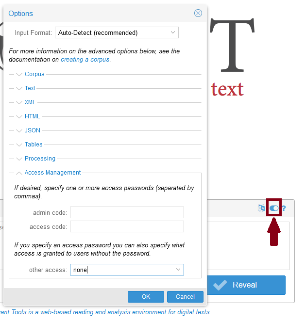

In the options menu, you will also note the ability to manage access to a corpus by creating a password. You may wish to explore the other options in the menu working with your own corpus; being able to start and / or stop reading when Voyant encounters a specified regular expression, for example, is helpful when working with texts that have preambles or postscripts you want to ignore in your analysis (e.g. files from Project Gutenberg).

**Important note:** if you need to set options, do so *before* uploading your documents. You will not be able to go back to the options menu after the dashboard is created, a process that begins as soon as the documents are uploaded.  

We will be using our own texts ("Upload") and not the pre-loaded corpora ("Open"), so Voyant will prompt us to upload them using a system dialog box. You can select multiple files by selecting the first file, holding the Shift key and selecting the last file in your list of documents. If you miss or forget a document, there will be an option to upload additional documents from the Voyant dashboard.

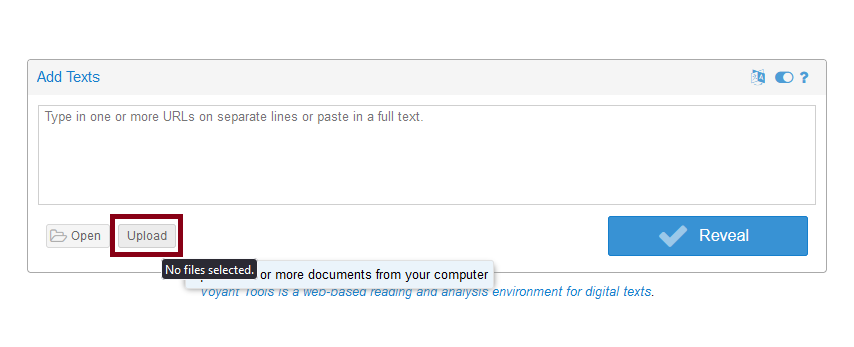

When you have selected your documents, Voyant will set about creating the dashboard immediately - which is why you will want to set any option parameters you need to adjust before uploading. It may take a few minutes for Voyant to create the dashboard, however, as it must read the PDF files; plain text files are relatively easy for Voyant to work with but if you have a large corpus, it may also take a while. A good time to grab a snack!

<!--If you have any trouble creating the corpus, you can use [the pre-loaded corpus with the lesson documents](https://voyant-tools.org/?corpus=e3e0d4140c53fc8ab68e19521f0ba24a) - although the link will at some point become inactive (corpus created May 21, 2023).-->

**Another important note:** when your dashboard is ready, **bookmark (or otherwise record) the URL**. Pasting the URL in your browser is the only way to return to it later; there is no global corpus search mechanism in Voyant, and no information is gathered from you to identify your corpus.

## **2.** Explore the Voyant dashboard

You will eventually be directed to the Voyant dashboard with your documents loaded, which will appear similar to the screenshot below:

There is much to explore! We encourage you to take a few minutes to try out some of the text analysis tools within Voyant. In particular, you may want to perform a bit of initial data analysis to identify any errors that may affect our results.

### Initial data analysis

The Summary tool in the bottom left corner gives us an overview of the text data in each document. If we scroll down in the tool, we will come across information about words, or tokens, in the corpus. It highlights the most used words in the corpus - canada, government, canadians, new and support - as well as the most distinctive words within each document.

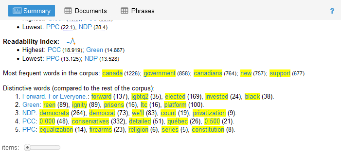

For the Green Party, "reen" and "inctive" are distinctive words within the document... but not words within the English language! Using the Reader tool, found at the centre of the top row of tools, we can search for "reen" and observe a formatting error in the PDF related to a reoccurring header - that we would probably want to omit from our analysis anyway.

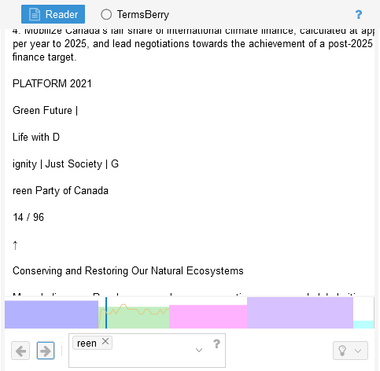

Of course, we have not performed any pre-processing steps on our documents because we are using them as a quick example to demonstrate the use of Voyant. Normally, we would try to catch and correct such errors before uploading the documents to Voyant (although you may want to use Voyant as an initial data analysis tool to surface repeated spelling errors). When you are working with your own documents, you can likely appreciate the importance of taking the time to verify the accuracy of the data!

### Download the corpus as plain text files

The other task we strongly recommend performing is actually to *download* the corpus documents for use in later steps of the lesson. Voyant has handily converted the PDF documents to a text format that we can export to a plain text file, which will make it easier for us to use them with MALLET and Python.

You can download the documents in plain text format by replacing the Summary tool with the Documents tool in the bottom left corner of the default Voyant dashboard. The "Download" button depicted in the screenshot below will then become visible. When choosing download options, ensure the "plain text" option is selected. Voyant will provide you with a .zip file containing each of the documents in .txt file format.

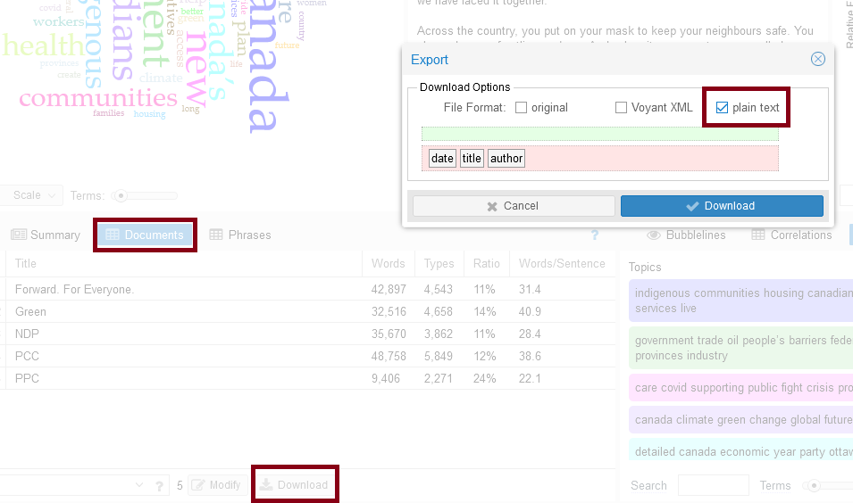

## **3.** Focus on topic modeling

Voyant has a topic modeling tool, "Topics," but it does not appear in any of the five tool areas in the default dashboard. You may also find it difficult to read or focus on the results of a single tool when it is only taking up a fifth of the page.

### Zoom in on the Topics tool

To bring up the Topics tool in the entire area of the dashboard: 
1. hover over the top right of the dashboard interface in the *blue* header (the icon looks like a window or the ARIA label is "Click to choose another tool for this panel location") and,
2. select "Topics" from "Corpus Tools" in the drop-down menu. 

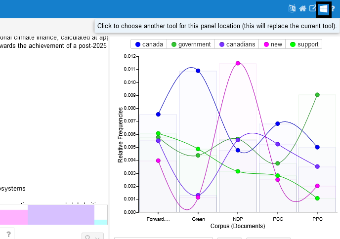

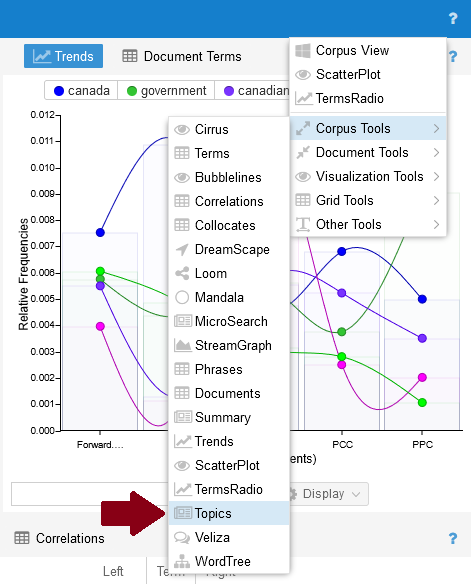

You can also replace tools in individual panels of the dashboard, but expanding it to fit the entire browser window makes the tool easier to work with. Return to the original dashbord view by selecting "Corpus View" from the same menu.

### Review the results

The Topics tool will fill the entire browser window, similar or identical to the screenshot below:

The topics (clusters of words) you are presented with are taken from the first 1000 words in each document. The shortest document we are working with (the PPC platform) has almost 10,000 words, so you may want to adjust the number to include a larger portion of each document. You can change the number of terms used per document via the tool options button on at the top right of the screen. 

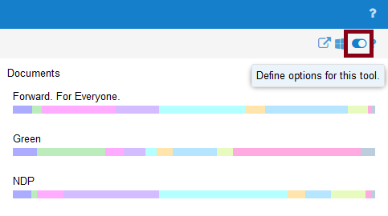

Voyant might timeout if you set the number too high and topics can actually become less distinctive when analyzing the entire document, since all parties tend to address the key issues of interest to voters. If we assume that the parties are front-loading their priorities, then the first 1000 or 5000 words will likely produce sufficiently meaningful topics.

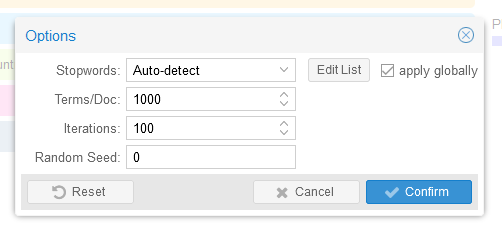

The option to edit the list of stopwords may be useful if your topics are initially comprised of common terms like "let's" or "it's" and so on. Voyant will automatically remove stopwords during the dashboard creation process, but the list of stopwords is necessarily broad and cannot capture every word that you may wish to leave out of your analysis.

### Adjust parameters to refine topics

There are also a few parameters at the bottom left of the interface you can adjust with respect to the number of:
* terms per topic, or how many words should appear on each line (10 by default), and, 
* topics, or the number of rows of terms (also 10 by default). 

Experiment with the values - are your topics more coherent, or easier to interpret, when they contain more terms or less? Does there appear to be semantic repetition within topics which could be streamlined with fewer topics?

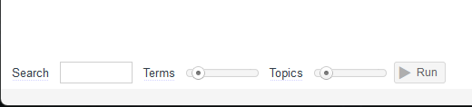

You will also notice a button in the parameters area labeled "Run." Each time you hit the "Run" button, Voyant attempts "to refine the model of which terms are best suited to which topics (based on co-occurrence in the documents)"[[1]](#1) by iterating the assignment of terms to topics 100 times (by default - can be changed in options as well). Therefore, you might get a different set of results each time you load up your corpus! However, after a few runs, you should notice that the terms no longer vary significantly or at all from run to run. 

### Analyze the topics

After our topics have reached a stasis point, we have the following term clusters:

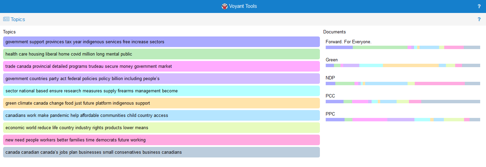

* government support provinces tax year indigenous services free increase sectors
* health care housing liberal home covid million long mental public
* trade canada provincial detailed programs trudeau secure money government market
* government countries party act federal policies policy billion including people’s
* sector national based ensure research measures supply firearms management become
* green climate canada change food just future platform indigenous support
* canadians work make pandemic help affordable communities child country access
* economic world reduce life country industry rights products lower means
* new need people workers better families time democrats future working
* canada canadian canada’s jobs plan businesses small conservatives business canadians

Again, your topics might not be the same as above! Particularly if we have each tweaked our parameters differently. In the topics above, we may have improved our results by changing the tokenization options before uploading the corpus to split tokens at non-letter characters rather than whitespace (i.e. "canada" & "s" vs "canada's"). We might also experiment with different numbers of terms and topics. But we can already start to interpret some themes from related words, such as "trade," "money," and "market" in the third topic which we might intepret as prioritizing economic strength.

### Highlight prevalence of a topic in corpus documents

When you have arrived at a set of meaningful, coherent topics that lend themselves to interpretation, you can start to dig deeper into your analysis. You can select a topic on the left side of the screen, and Voyant will highlight their prevalence in each of the documents. 

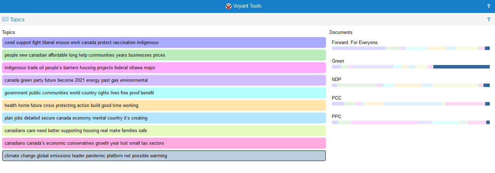

In the visualization above, the cluster "climate change global emissions leader pandemic platform net possible warming" (from a different instance of the model than the topics above) is most prevalent by far in the Green party platform. Given the centrality of environmental issues to the Green party, the repeated presence of the topic is not surprising! But there may be interesting areas of overlap between parties to observe as well, or combination of terms within topics.

### Hightlight distribution of topics within specific documents

You can also select any of the documents from the right-side pane to be shown the proportional distribution of topics within individual texts. Here, the most prevalent topic in the NDP platform is "canadians care need better supporting housing real make families safe." The least prevalent topic in the NDP platform appears most frequently in the plaform of the party at the other end of the political spectrum, the PPC. 

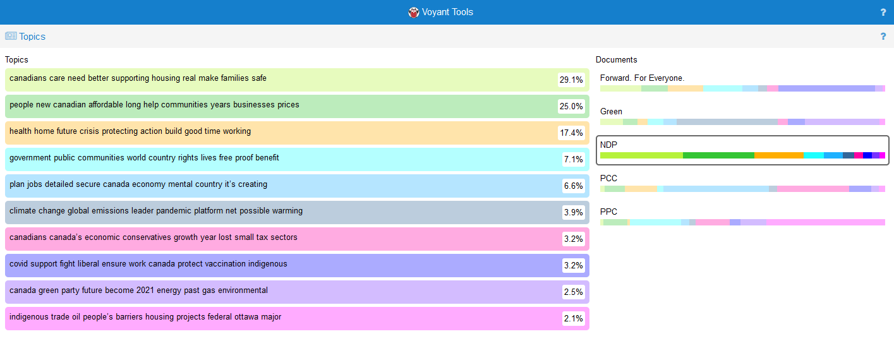

### Export probablistic weights of topics

The probablistic weights of the topics within the documents can be exported via the export button, which looks like a square with an arrow pointing out of it and has the ARIA label "Export a URL, an embeddable tool, data or a bibliographic reference":

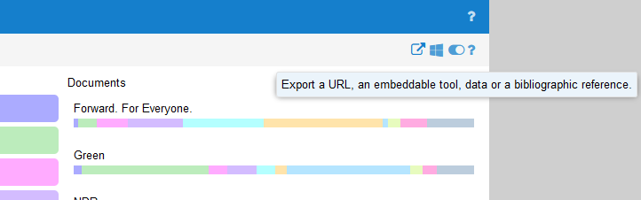

From the export menu, select "export current data as tab separated values" - you can copy the values to a spreadsheet and use them, for example, in [a sonification project](learn-more.html).

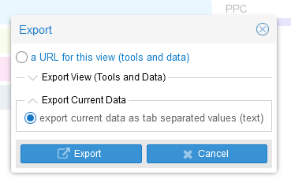

## Try it with your data

Try Voyant out with your own pre-processed corpus; if you get so caught up in your analysis that you forget to finish the lesson, we will completely understand :-)

Otherwise, let us try our next approach: topic modeling with the command-line tool, MALLET!

## Voyant Tools Server

Voyant Tools has a downloadable version of the application available in the form of [Voyant Server](https://github.com/voyanttools/VoyantServer/releases/tag/2.6.5) (download and unzip .zip file). Voyant Server can be run from your computer without an Internet connection, and accessed via your web browser. The user experience of Voyant Server is identical to that of the web app we used in the previous section.

Using Voyant Server is the preferred approach if you will be working with very large corpora or if you are working with documents that should not be publically accessible due to privacy or copyright concerns (although you can password protect your corpus). One drawback of Voyant Server, however, is that it relies on a very narrow window of Java versions - between Java 8 and Java 11.

If you have Java 8, 9, 10 or 11 installed on your computer, Voyant Server will be relatively easy to use. Otherwise, you may need to run multiple versions of Java on your machine - which is doable! - but more involved. Refer to instructions on running multiple versions of Java [in Windows (Sven Woltmann)](https://www.happycoders.eu/java/how-to-switch-multiple-java-versions-windows/) or [on Mac (Jayson Minard on StackOverflow)](https://stackoverflow.com/questions/52524112/how-do-i-install-java-on-mac-osx-allowing-version-switching/52524114#52524114).

When Voyant Server runs as smoothly [as its documentation suggests](https://voyant-tools.org/docs/#!/guide/server), it is superior to the web app. But if you encounter technical barriers in using Voyant Server and do not have the time to troubleshoot them, the web app is perfectly viable option for analysis and short-term dissemination. 

## References
<a id="1">[1]</a>
"Topics." *Voyant Tools Help*. https://voyant-tools.org/docs/#!/guide/topics. 

Next --> [Topic Modeling with MALLET](mallet.html)

 
