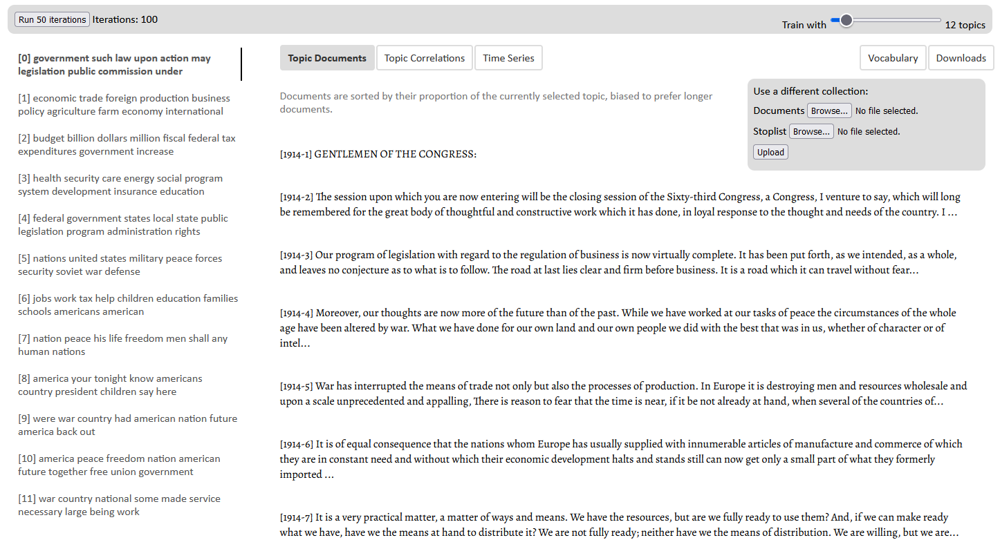
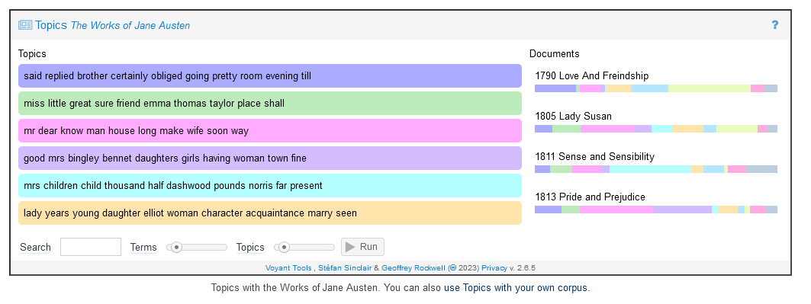

# What is Topic Modeling?

In a digital scholarship context, topic modeling is typically used to get a sense of what a document, set of documents (corpus) or subset of documents is about in a broad sense. “Documents” here could be articles, archives, web pages, tweets, transcripts of interviews and so on. 

You may have used term frequencies - that is, counts of how many times a specific word or words appear in a corpus - for the same purpose. For example, in a political party's platform, the frequent mention of words like "climate," "green" and "environment" may allow you to hypothesize that climate action is one of their priorities. However, while we humans can infer the related meanings of words like "climate," "green" and "environment," a computer cannot make the same connections between words unless explicitly programmed. Writing rules to capture every group of words in a potential topic would be impossibly onerous, to say the least! 

Term frequency counts are also less helpful without context. Even if "board" is one of the most commonly occurring words in the text, you might ask how it is intended: a Board of Directors? To board a vessel? A board of wood? And so on. Knowing that "board" often appears near the words "directors," "ship" or "hammer" would clarify the meaning for us. 

Topic modeling adds nuance by grouping terms (words) that appear in the text together to a greater degree than others; essentially, topic modeling creates a context in which to understand the term(s). Or, put another way:

> “A topic can be thought of as the cluster of words that tend to come up in a discussion and therefore to co-occur more frequently than they otherwise would, whenever the topic is being discussed.” (Ignatow & Mihalcea, 2) [1](#1)

## Topic modeling in practice

Topic modeling can be an elusive concept to grasp relative to other text analysis techniques like named entity recognition (NER) or part-of-speech (POS) tagging. A demonstration might help to clarify: visit David Mimno's [jsLDA](https://mimno.infosci.cornell.edu/jsLDA/jslda.html) web application to try it out yourself!

There will be a demo corpus already loaded that you can experiment with. Try changing the number of topics -- as too many topics can lead to overlap, and too few can make the clusters overly general -- then running a few iterations, which refines the model.

Your topics may differ! But you may note a coherence within clusters of words, or topics, such as:
* economic trade foreign production business policy agriculture farm economy international
* budget billion dollars million fiscal federal tax expenditures government increase
* health security care energy social program system development insurance education
* federal government states local state public legislation program administration rights
* nations united states military peace forces security soviet war defense

You can also upload your own documents to jsLDA. Initially, the topics returned will be filled with common words like "may," "the" and "for," and so, will not tell us much about the text or corpus. In order to remove these words from the analysis, you will need to upload a text file with stopwords to omit. Read more about stopwords in the [*Identifying Proper Nouns with Named Entity Recognition*](https://scds.github.io/text-analysis-2/ner.html#stop-word-removal) workshop.

If you wish to supply your own list of stopwords to the jsLDA web application, you can copy and paste the [list of words used by the Natural Language Toolkit (NLTK) Python library](https://gist.github.com/sebleier/554280) in a text file (i.e. .txt file extension). If you observe words in topics that you would like to ignore after uploading the list, you can add those words to your list and re-upload the stopwords file.

It may be clear from our results with Mimno's tool that it would be difficult if not impossible to model topics on texts at scale without computational means. At the same time, there are evident trade-offs in automating tasks through the use of probablistic models.

## How topic modeling works

Numerous explanatory articles written on topic modeling have been written by Digital Humanities scholars, including David Blei's "[Probabilistic Topic Models](https://www.cs.columbia.edu/~blei/papers/Blei2012.pdf)," Graham, Weingart and Milligan's "[Getting Started with Topic Modeling and MALLET](https://programminghistorian.org/en/lessons/topic-modeling-and-mallet)" and Ted Underwood's "[Topic Modeling Made Just Simple Enough](https://tedunderwood.com/2012/04/07/topic-modeling-made-just-simple-enough/)" (from which the explanation provided below borrows). They are great resources if you are new to the idea of topic modeling and would like to know more about how it works, as we will only briefly discuss it here in relation to the tasks we will be performing in the lesson. [2](#2)

The overall premise of topic modeling is perhaps most succinctly captured by Graham, Weingart and Milligan: 

> \[Topic modeling programs] assume that any piece of text is composed (by an author) by selecting words from possible baskets of words where
> each basket corresponds to a topic. If that is true, then it becomes possible to mathematically decompose a text into the probable baskets
> from whence the words first came. The tool goes through this process over and over again until it settles on the most likely distribution
> of words into baskets, which we call topics.

Topics "can be understood as a collection of words that have different probabilities of appearance in passages discussing the topic" (Underwood) [3](#3). But how does a topic modeling tool arrive at the topics it presents?

Typically, the topic modeling workflow begins by creating dictionary of all words in the corpus so that the number of times each word appears (term frequency) can be weighted against the term frequency of other words. The topic modeling tool or program then splits the text data into segments of equal length, and counts the occurrence of terms within the segment. 

Each segment is presumed to contain approximately one topic, though the topic is not usually unique within the corpus; that is, when we write, we typically talk about one main topic or theme for a paragraph or so. It is possible in most tools to adjust the length of the segments, and you can experiment with values according to the format of your text data: for example, segments of 100 for articles or segments of 50 for micro-blog posts. Of course, because we are not manually segmenting the text each time the author changes the subject, there are trade-offs for the coherence of our topics.

The screenshot below is from the [help documentation for Voyant Tools](https://voyant-tools.org/docs/#!/guide/topics), showing the distribution of topics across the works of Jane Austen. For example, the topic "good mrs bingley bennet daughters girls having woman town fine" is most prevalent - unsurprisingly - in *Pride and Predjudice* (1813) as shown in the visualization on the right. But it also appears in each of the other texts as well. Not all terms will appear in each segment containing the topic, but there is a higher probability that a term from the topic will appear when the topic is discussed. The term "bennet" likely does not occur in Austen texts that are not *Pride and Predjudice* but some of the other terms from the topic - such as "good," "having," and "town" - will be present. 

Topics, then, should be interpreted holistically - and they do require human interpretation! You might find it useful to name your topics based on clusters of related terms in the topic; for example, "workers," "wage," "strike" might constitute a topic that you interpret as labour organizing. Some topics will have a strong sense of semantic coherence, others may be a meaningless jumble of words.  

Part of the reason for the "jumbly" nature of topics is because the latent Dirichlet algorithm (LDA), which many topic modeling tools use, initially assigns terms to topics randomly - since topics are generally not known in advance. In topic modeling, we perform repeated "passes" or iterations to refine the topics based on the co-occurence in the text data of the terms. Initially, topics might change quite drastically each time topic modeling is run but will eventually remain fairly consistent. Most topic modeling tools allow you to set the number of passes you want to do.

Each topic technically contains every term from the dictionary - all unique words used in the text. What is shown in the topic are the top *n* number of terms in the topic; that is, the terms with the highest probability of occurring in segments containing the topic. In the topic modeling tools we will be using - Voyant, MALLET and Gensim - you can set the number of terms per topic. You can also set the number of topics to model. Experiment with the values to find an optimal balance between too few (too generic to be interesting) and too many (too noisy to identify patterns).  

As you work through the lesson, consider how the process described above maps to the steps and features in the various tools you will be using - and have fun topic modeling!

## References

<a id="1">\[1]</a>Ignatow, G., & Mihalcea, R. (2018). *An introduction to text mining : research design, data collection, and analysis.* SAGE Publications, Inc.

<a id="2">\[2]</a>Graham, S., Weingart, S., & Milligan, I. (2012). Getting started with topic modeling and MALLET. *Programming Historian.* https://programminghistorian.org/en/lessons/topic-modeling-and-mallet.

<a id="3">\[3]</a>Underwood, T. (2012). Topic modeling made just simple enough. *Using large digital libraries to advance literary history*. https://tedunderwood.com/2012/04/07/topic-modeling-made-just-simple-enough/.

 

Next --> [Topic Modeling with Voyant Tools](tmv.html)
